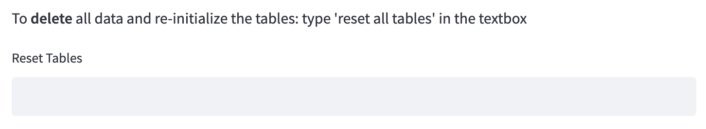

# Description 
Application to store and visualize soccer stats.

## Tech-stack
- FastAPI backend  
- Streamlit frontend  
- PostgreSQL database  
- SQLAlchemy ORM  

## Environment
A conda `environment.yml` is present in the repository. Create your environment with 
`conda env create -f environment.yml` and activate it with 
`conda activate soccers_stats`.

## Usage
### Local database
The application can function with a PostgreSQL database that is running locally.
Make sure to define local environment variables `DB_SERVER` and `DB_USER`.  

### Other database location
Additionally, the application can be used with a database running at a different
location. For this, define local environment variables `DB_SERVER`, `DB_USER`, 
`DB_PASSWORD` and `DB_NAME`.

### Running the application
Run the application by, firstly, starting the FastAPI backend using:  
`uvicorn endpoints:app --reload`  

and, secondly, the Streamlit frontend using:  
`streamlit run Main_Page.py`  

## Re-initialization of data
To re-initialize all tables or to perform an initial load, follow the steps above and 
navigate to the *Insert Data* page in the frontend. Here follow the instructions at 
the top of the page:

